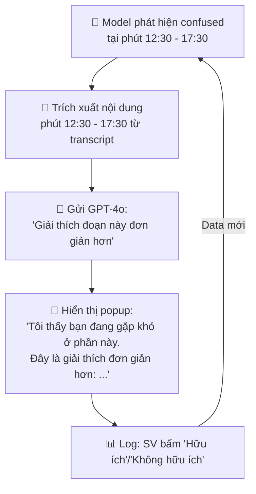
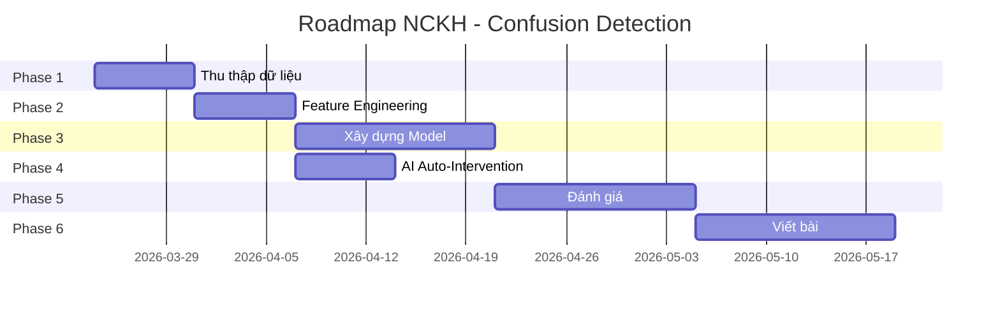

# 🎓 NCKH: Phát hiện bối rối đa phương thức trong học trực tuyến

> **Đề tài**: *"Phát hiện bối rối của sinh viên trong học trực tuyến bằng phân tích đa phương thức: hành vi xem video, nhận diện cảm xúc, và kết quả quiz — kèm cơ chế can thiệp tự động bằng AI"*

## Sơ đồ kiến trúc hệ thống


---

## Hệ thống hiện tại (Baseline)

File: [confusion_detector.dart](file:///d:/MobileProject/alarmm/lib/features/course/presentation/services/confusion_detector.dart)

```
Hiện tại: Rule-based scoring
├── pause ≥ 3     → +30 điểm
├── rewind ≥ 2    → +40 điểm  
├── emotion=confused → +40 điểm
├── Tổng ≥ 60     → Trigger popup
└── Cooldown: 5 phút
→ Hạn chế: threshold cố định, không học từ data, không phân biệt loại pause
```

---

## Roadmap 6 Phase

### Phase 1 — Thu thập dữ liệu (Data Collection) `~1 tuần`

Mục tiêu: Tạo dataset confusion có nhãn (labeled) từ sinh viên thực.

#### 1.1 Logging chi tiết hơn

Hiện tại chỉ đếm `pauseCount`, `rewindCount`, `skipCount`. Cần log thêm:

| Feature mới | Mô tả | Tại sao quan trọng |
|---|---|---|
| `pause_duration` | Thời lượng mỗi lần pause (giây) | Pause 2s (nghỉ tay) ≠ Pause 30s (đang confused) |
| `pause_timestamp` | Tại phút nào của video | Biết đoạn nào gây confused |
| `rewind_distance` | Tua lại bao nhiêu giây | Tua lại 5s (nghe lại) ≠ tua lại 60s (không hiểu cả đoạn) |
| `rewind_repeat` | Tua lại cùng đoạn bao nhiêu lần | Repeat ≥ 2 = dấu hiệu mạnh |
| `playback_speed` | Tốc độ phát (0.5x, 1x, 2x) | Chuyển từ 2x → 0.5x = đoạn khó |
| `seek_pattern` | Pattern tua tới/lui liên tục | Tua qua lại loạn = rất confused |

#### 1.2 Self-report popup

Sau mỗi 5-10 phút xem video, hiện popup nhẹ hỏi sinh viên:

```
"Bạn cảm thấy thế nào về đoạn vừa xem?"
[😊 Hiểu rõ] [🤔 Hơi khó] [😫 Không hiểu] [⏭️ Bỏ qua]
```

→ Đây chính là **ground truth label** cho dataset.

#### 1.3 Emotion log mỗi 30s

Lưu chuỗi emotion theo timeline:
```json
[
  {"t": 0, "emotion": "focused", "confidence": 0.85},
  {"t": 30, "emotion": "focused", "confidence": 0.80},
  {"t": 60, "emotion": "confused", "confidence": 0.72},
  {"t": 90, "emotion": "frustrated", "confidence": 0.65}
]
```

→ Phát hiện **transition pattern**: focused → confused → frustrated = dấu hiệu mạnh.

---

### Phase 2 — Feature Engineering `~1 tuần`

Từ raw data, tạo feature vector cho mỗi **segment 5 phút** của video:

```mermaid
graph LR
    subgraph RAW["Raw Data"]
        A["Video behavior logs"]
        B["Emotion timeline"]
        C["Quiz scores"]
    end
    subgraph FEATURES["Feature Vector (1 segment = 5 phút)"]
        F1["pause_count"]
        F2["avg_pause_duration"]
        F3["rewind_count"]
        F4["rewind_same_spot"]
        F5["speed_changes"]
        F6["confused_emotion_ratio"]
        F7["emotion_transition_count"]
        F8["quiz_score_after_segment"]
        F9["time_to_answer_quiz"]
    end
    subgraph LABEL["Label (Ground Truth)"]
        L["0: Không confused\n1: Hơi confused\n2: Rất confused"]
    end
    RAW --> FEATURES --> LABEL
```



| # | Feature | Nguồn | Giải thích |
|---|---|---|---|
| 1 | `pause_count` | Behavior | Số lần pause trong segment |
| 2 | `avg_pause_duration` | Behavior | TB thời lượng pause (giây) |
| 3 | `long_pause_count` | Behavior | Số lần pause > 10s |
| 4 | `rewind_count` | Behavior | Số lần rewind |
| 5 | `rewind_same_spot` | Behavior | Tua lại cùng đoạn ≥ 2 lần |
| 6 | `speed_decrease` | Behavior | Giảm tốc độ phát? (bool) |
| 7 | `confused_ratio` | Emotion | % thời gian emotion=confused |
| 8 | `frustrated_ratio` | Emotion | % thời gian emotion=frustrated |
| 9 | `emotion_transitions` | Emotion | Số lần chuyển emotion |
| 10 | `neg_emotion_streak` | Emotion | Chuỗi emotion tiêu cực dài nhất |
| 11 | `quiz_score` | Quiz | Điểm quiz sau segment (nếu có) |
| 12 | `quiz_time` | Quiz | Thời gian trả lời quiz (giây) |

---

### Phase 3 — Xây dựng Model `~2 tuần`

#### 3.1 So sánh 4 phương pháp

| Method | Mô tả | Vai trò trong bài |
|---|---|---|
| **Baseline** | Rule-based hiện tại (threshold cố định) | Đối chứng |
| **Method A** | Logistic Regression trên feature vector | Simple ML |
| **Method B** | Random Forest / XGBoost | Traditional ML |
| **Method C** | LSTM trên chuỗi behavior + emotion timeline | Deep Learning |

#### 3.2 Ablation Study

Tắt từng nguồn data → đo ảnh hưởng:

| Thí nghiệm | Features sử dụng | Kết quả |
|---|---|---|
| Behavior only | F1-F6 | ? |
| Emotion only | F7-F10 | ? |
| Quiz only | F11-F12 | ? |
| Behavior + Emotion | F1-F10 | ? |
| Behavior + Quiz | F1-F6, F11-F12 | ? |
| **All (đề xuất)** | **F1-F12** | **?** |

→ Chứng minh multimodal **tốt hơn** single-modal.

---

### Phase 4 — AI Auto-Intervention (Ý tưởng bổ sung của bạn) `~1 tuần`

> *Khi phát hiện confused → AI tự lấy nội dung tại thời điểm đó → Giải thích*



Kỹ thuật:

```
1. Confused detected tại currentPosition = 750 giây (phút 12:30)
2. Lấy transcript từ giây 630 → 750 (2 phút trước đó)
3. Gọi GPT: "Sinh viên đang confused khi xem đoạn này: {transcript}.
            Hãy giải thích lại nội dung này một cách đơn giản hơn,
            dùng ví dụ dễ hiểu, bằng tiếng Việt."
4. Hiển thị kết quả trong popup thay vì chỉ hỏi "Bạn cần giải thích thêm không?"
```

**So sánh với hiện tại:**

| | Hiện tại | Đề xuất mới |
|---|---|---|
| Phát hiện | Rule-based | ML model multimodal |
| Giao diện | Popup hỏi "Cần giải thích?" | Popup **kèm sẵn giải thích** |
| Hành động user | Phải bấm → mở AI Chat → hỏi lại | **Không cần hỏi, AI tự giải thích** |
| Nội dung | Không biết đoạn nào khó | **Biết chính xác timestamp** đoạn khó |

---

### Phase 5 — Đánh giá (Evaluation) `~2 tuần`

#### 5.1 Đánh giá Model (kỹ thuật)

| Metric | Cách đo |
|---|---|
| **Accuracy** | Tỷ lệ dự đoán đúng confused/not confused |
| **Precision** | Trong số dự đoán "confused", bao nhiêu đúng thật |
| **Recall** | Trong số thật sự confused, model phát hiện được bao nhiêu |
| **F1-Score** | Trung bình hài hòa Precision & Recall |
| **AUC-ROC** | Diện tích dưới đường cong ROC |

#### 5.2 Đánh giá Intervention (sư phạm)

Chia sinh viên thành 3 nhóm:

| Nhóm | Cơ chế | Số SV |
|---|---|---|
| **Control** | Không có intervention | 10-15 |
| **Baseline** | Popup hỏi "Cần giải thích?" (hiện tại) | 10-15 |
| **Proposed** | AI tự phát hiện + tự giải thích | 10-15 |

Đo lường:

| Metric | Cách đo |
|---|---|
| **Quiz score improvement** | So sánh điểm quiz sau khi có / không có intervention |
| **Completion rate** | % SV xem hết video |
| **Re-watch rate** | Số lần rewind giảm sau intervention? |
| **User satisfaction** | Survey SUS (System Usability Scale) |
| **Intervention acceptance** | % SV bấm "Hữu ích" trên popup AI |

---

### Phase 6 — Viết bài (Paper Writing) `~2 tuần`

#### Cấu trúc bài NCKH

```
1. Đặt vấn đề
   - Bối cảnh: e-learning tăng trưởng, SV hay bỏ giữa chừng
   - Gap: Các hệ thống hiện tại không phát hiện được SV confused real-time
   
2. Tổng quan nghiên cứu
   - Confusion detection: EEG (không scalable), facial (privacy), behavior logs (hạn chế)
   - Adaptive learning systems
   - AI intervention trong giáo dục
   
3. Phương pháp đề xuất
   - Kiến trúc multimodal: behavior + emotion + quiz
   - Feature engineering
   - Model: so sánh 4 approaches
   - Auto-intervention bằng GPT-4o
   
4. Thực nghiệm
   - Bộ dữ liệu: N sinh viên, M giờ video
   - Kết quả model: bảng so sánh accuracy/F1
   - Ablation study: multimodal > single-modal
   - User study: intervention group vs control group
   
5. Kết luận
   - Đóng góp: multimodal fusion + auto AI intervention
   - Hạn chế: dataset nhỏ, cần mở rộng
   - Hướng phát triển: RAG, on-device model
```

---

## Timeline tổng



| Phase | Nội dung | Thời gian |
|---|---|---|
| Phase 1 | Thu thập data + logging | 1 tuần |
| Phase 2 | Feature engineering | 1 tuần |
| Phase 3 | Xây dựng + so sánh model | 2 tuần |
| Phase 4 | AI auto-intervention | 1 tuần (song song Phase 3) |
| Phase 5 | Evaluation + user study | 2 tuần |
| Phase 6 | Viết bài | 2 tuần |
| **Tổng** | | **~8-9 tuần** |

---

## Files cần tạo/sửa cho code

| Action | File | Mô tả |
|---|---|---|
| **MODIFY** | [confusion_detector.dart](file:///d:/MobileProject/alarmm/lib/features/course/presentation/services/confusion_detector.dart) | Thêm logging chi tiết, ML model inference |
| **NEW** | `confusion_data_logger.dart` | Service log behavior + emotion timeline |
| **NEW** | `self_report_widget.dart` | Popup tự đánh giá mức độ hiểu |
| **NEW** | `confusion_intervention_sheet.dart` | UI hiện giải thích AI tự động |
| **MODIFY** | [lesson_player_page.dart](file:///d:/MobileProject/alarmm/lib/features/course/presentation/pages/lesson_player_page.dart) | Tích hợp logger + self-report + intervention |
| **NEW** | `backend/routes/ai/explain-segment.dart` | Endpoint AI giải thích đoạn confused |
| **NEW** | `backend/routes/confusion/log.dart` | Endpoint lưu confusion data |
| **NEW** | `backend/routes/confusion/analytics.dart` | Endpoint phân tích confusion patterns |
| **NEW** | `scripts/train_confusion_model.py` | Python script train model (sklearn/pytorch) |
| **NEW** | `scripts/feature_extraction.py` | Trích xuất features từ raw logs |
